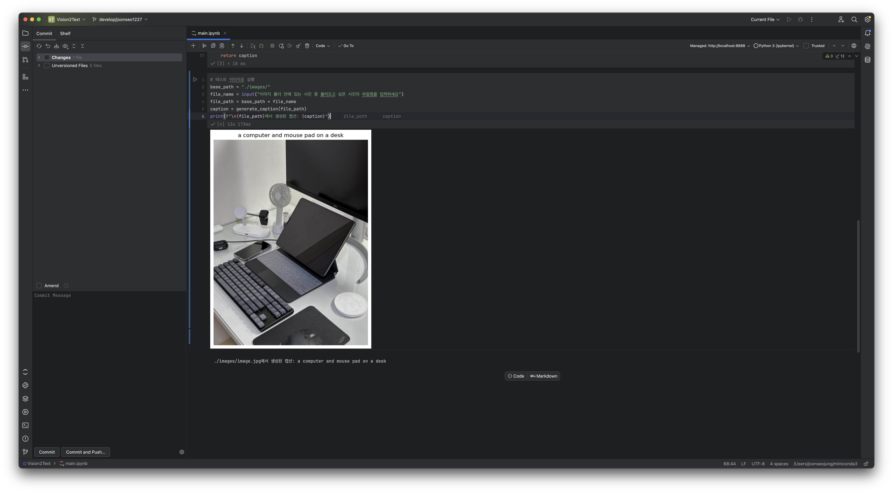

# 이미지 캡션 생성 프로그램

---

이 프로그램은 BLIP(Bootstrapping Language-Image Pre-training) 모델을 사용하여 이미지에 대한 설명문(캡션)을 자동으로 생성하는 Python 스크립트입니다.

## 주요 기능

- 입력된 이미지에 대해 영어 기반의 설명문 생성
- 이미지와 생성된 캡션의 시각화
- GPU 가속 지원 (CUDA 사용 가능 시)

## 필요 라이브러리

```python
- cv2 (OpenCV)
- torch (PyTorch)
- PIL (Python Imaging Library)
- transformers
- matplotlib
- os
```

## 데모



## 사용 방법

1. 이미지 파일(.jpg)을 준비합니다. (파일명은 영어로 해야합니다.)
2. 파일을 image 폴더에 저장합니다.
3. 코드에서 맨 마지막 셀을 실행시킵니다.
4. 저장한 파일 이름을 입력합니다.

## 주의사항

1. CUDA 지원 GPU가 없는 경우 CPU에서 실행되며, 처리 속도가 느릴 수 있습니다.
2. 이미지 파일은 일반적인 이미지 형식(jpg, png 등)을 지원합니다.
3. 생성되는 캡션은 영어로 출력됩니다.

## 오류 처리

프로그램은 다음과 같은 상황에서 적절한 오류 메시지를 반환하며 종료됩니다.

- 이미지 파일이 존재하지 않는 경우
- 이미지 파일을 읽을 수 없는 경우
- 모델 초기화 중 오류가 발생한 경우
- 캡션 생성 중 오류가 발생한 경우
- 결과 시각화 중 오류가 발생한 경우

## 출력 예시

프로그램 실행 시:

1. 모델 로딩 상태와 사용 중인 디바이스 정보를 두 번째 셀에서 출력
2. 이미지와 생성된 캡션이 포함된 이미지를 마지막 셀에서 표시
3. 생성된 캡션 텍스트를 출력 및 표시
